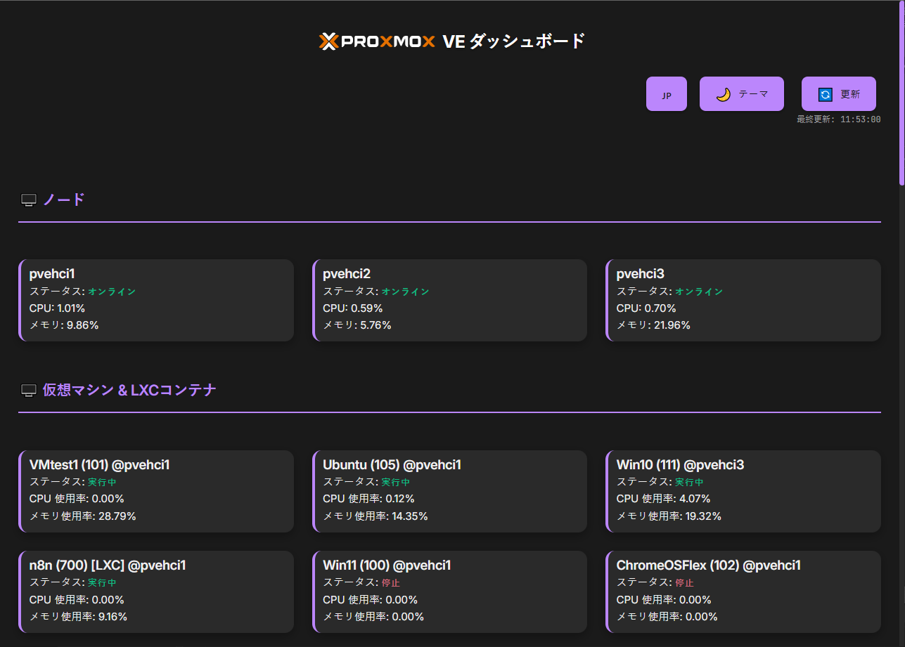

# Proxmox VE ダッシュボード <sub>v0.1</sub>

シンプルでモダンなレスポンシブ Proxmox VE ダッシュボードで、直感的なノード、仮想マシン、コンテナ監視インターフェースを提供します。


## 📸 スクリーンショット



## ✨ 機能特色

### 🖥️ 監視機能
- **リアルタイムノード監視**：CPU、メモリ使用率、ノード状態
- **仮想マシン管理**：VM 状態、リソース使用状況、リアルタイム更新
- **LXC コンテナ管理**：コンテナ状態監視とリソース統計
- **自動更新**：15秒ごとにデータを自動更新

### 🎨 ユーザーインターフェース
- **レスポンシブデザイン**：デスクトップ、タブレット、スマートフォンなど様々なデバイスをサポート
- **ダーク/ライトテーマ**：切り替え可能なモダンテーマ
- **多言語サポート**：繁体中国語、簡体中国語、英語、日本語、韓国語
- **直感的操作**：カードをクリックして個別項目の状態を更新

### ⚙️ 設定管理
- **初回実行設定**：自動的に設定ダイアログを表示
- **接続テスト**：設定前に Proxmox 接続をテスト
- **設定の永続化**：設定を `settings.json` に保存
- **動的設定**：再起動なしで新しい設定を適用

## 🚀 クイックスタート

### システム要件
- Node.js 18+ 
- Proxmox VE サーバーへのネットワーク接続
- Proxmox VE API Token

### インストール手順

1. **プロジェクトのクローン**
   ```bash
   git clone https://github.com/yourusername/proxmox-dashboard.git
   cd proxmox-dashboard
   ```

2. **依存関係のインストール**
   ```bash
   npm install
   ```

3. **サービスの起動**
   ```bash
   node server.js
   ```

4. **ブラウザを開く**
   `http://localhost:3000` にアクセス

### 初回設定

1. **Proxmox API Token の取得**
   - Proxmox VE Web インターフェースにログイン
   - `Datacenter` → `Permissions` → `API Tokens` に移動
   - 新しい Token を作成（推奨形式：`root@pam!dashboard-token`）

2. **接続情報の設定**
   - 初回起動時に自動的に設定ダイアログが表示されます
   - Proxmox ホスト IP アドレスを入力（例：192.168.1.100）
   - Token 名を入力（例：root@pam!dashboard-token）
   - Token 値を入力（API Token の秘密鍵、例：xxxxxxxx-xxxx-xxxx-xxxx-xxxxxxxxxxxx）
   - 「接続テスト」をクリックして接続を確認
   - 「保存して開始」をクリック

## 📖 使用方法

### 主要機能

#### ノード監視
- すべての Proxmox ノードの状態を表示
- リアルタイムの CPU とメモリ使用率
- ノードカードをクリックして状態を更新

#### 仮想マシン管理
- すべての VM と LXC コンテナを表示
- 状態インジケーター（実行中/停止）- 実行中の VM が優先表示
- リソース使用統計
- カードをクリックして個別項目を更新

#### 設定管理
- 右上の「⚙️ 設定」ボタンをクリック
- Proxmox 接続情報を変更可能
- 接続テスト機能をサポート

### テーマと言語
- **テーマ切り替え**：「🌙 テーマ」ボタンをクリック
- **言語切り替え**：「🇯🇵 言語」ボタンをクリックして循環切り替え

## 🛠️ 技術アーキテクチャ

### バックエンド技術
- **Node.js**：サーバー実行環境
- **Express.js**：Web フレームワーク
- **Axios**：HTTP クライアント
- **File System**：設定ファイル管理

### フロントエンド技術
- **ネイティブ JavaScript**：フレームワーク依存なし
- **CSS3**：モダンなスタイルとアニメーション
- **HTML5**：セマンティックマークアップ
- **Responsive Design**：レスポンシブレイアウト

### API エンドポイント
- `GET /api/status` - ノードと VM 状態の取得
- `GET /api/settings` - 現在の設定の取得
- `POST /api/settings` - 設定の更新
- `POST /api/test-connection` - 接続テスト
- `GET /api/check-first-run` - 初回実行チェック

## 📁 プロジェクト構造

```
proxmox-dashboard/
├── server.js              # メインサーバーファイル
├── package.json           # プロジェクト設定
├── settings.json          # 設定ファイル（自動生成）
├── README.md             # プロジェクト説明
├── public/               # 静的ファイル
│   ├── index.html        # メインページ
│   ├── script.js         # フロントエンドロジック
│   ├── style.css         # スタイルファイル
│   └── *.svg            # Proxmox Logo
└── node_modules/         # 依存パッケージ
```

## 🔧 設定説明

### 設定ファイル形式 (`settings.json`)
```json
{
  "proxmox_host": "192.168.1.100",
  "proxmox_token_name": "root@pam!dashboard-token",
  "proxmox_token_value": "xxxxxxxx-xxxx-xxxx-xxxx-xxxxxxxxxxxx"
}
```

### 環境変数
現在サポートされている環境変数：
- `PORT`：サーバーポート番号（デフォルト：3000）

## 🐛 トラブルシューティング

### よくある問題

**Q: Proxmox サーバーに接続できない**
- Proxmox ホスト IP アドレスが正しいことを確認
- ファイアウォール設定を確認（ポート 8006）
- API Token の権限が十分であることを確認

**Q: 設定ダイアログが表示されない**
- ブラウザのキャッシュをクリア
- `settings.json` ファイルが存在しないことを確認
- ブラウザの Console エラーメッセージを確認

**Q: データが更新されない**
- ネットワーク接続を確認
- Proxmox API Token が有効であることを確認
- サーバーの Console エラーメッセージを確認

### デバッグモード
ブラウザの開発者ツール (F12) を開き、Console タブのエラーメッセージを確認してください。

## 🤝 貢献ガイド

Issue と Pull Request の提出を歓迎します！

### 開発環境設定
1. プロジェクトを Fork
2. 機能ブランチを作成：`git checkout -b feature/amazing-feature`
3. 変更をコミット：`git commit -m 'Add amazing feature'`
4. ブランチをプッシュ：`git push origin feature/amazing-feature`
5. Pull Request を作成

### コードスタイル
- 2 スペースインデントを使用
- ESLint ルールに従う
- 適切なコメントを追加

## 📄 ライセンス

このプロジェクトは MIT ライセンスの下で提供されています - 詳細は [LICENSE](LICENSE) ファイルを参照してください

## 🙏 謝辞

- [Proxmox VE](https://www.proxmox.com/) - 優れた仮想化プラットフォーム
- [Node.js](https://nodejs.org/) - JavaScript 実行環境
- [Express.js](https://expressjs.com/) - Web アプリケーションフレームワーク

---

⭐ このプロジェクトがお役に立てば、Star をお願いします！

---

**このアプリは [Cursor](https://cursor.sh/) と [Gemini-CLI](https://github.com/google-gemini/gemini-cli) の支援により作成されました** 