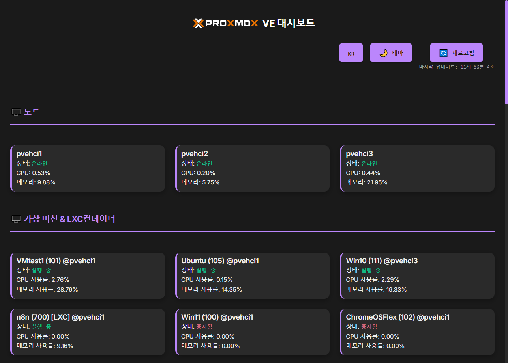

# Proxmox VE 대시보드 <sub>v0.1</sub>

간단하고 현대적이며 반응형인 Proxmox VE 대시보드로 직관적인 노드, 가상 머신 및 컨테이너 모니터링 인터페이스를 제공합니다.


## 📸 스크린샷



## ✨ 기능 특징

### 🖥️ 모니터링 기능
- **실시간 노드 모니터링**：CPU, 메모리 사용률, 노드 상태
- **가상 머신 관리**：VM 상태, 리소스 사용 상황, 실시간 업데이트
- **LXC 컨테이너 관리**：컨테이너 상태 모니터링 및 리소스 통계
- **자동 새로고침**：15초마다 데이터 자동 업데이트

### 🎨 사용자 인터페이스
- **반응형 디자인**：데스크톱, 태블릿, 스마트폰 등 다양한 기기 지원
- **다크/라이트 테마**：전환 가능한 현대적 테마
- **다국어 지원**：번체 중국어, 간체 중국어, 영어, 일본어, 한국어
- **직관적 조작**：카드 클릭으로 개별 항목 상태 새로고침

### ⚙️ 설정 관리
- **첫 실행 설정**：자동으로 설정 대화상자 표시
- **연결 테스트**：설정 전 Proxmox 연결 테스트
- **설정 영속성**：설정을 `settings.json`에 저장
- **동적 설정**：재시작 없이 새 설정 적용

## 🚀 빠른 시작

### 시스템 요구사항
- Node.js 18+ 
- Proxmox VE 서버로의 네트워크 연결
- Proxmox VE API Token

### 설치 단계

1. **프로젝트 클론**
   ```bash
   git clone https://github.com/yourusername/proxmox-dashboard.git
   cd proxmox-dashboard
   ```

2. **의존성 설치**
   ```bash
   npm install
   ```

3. **서비스 시작**
   ```bash
   node server.js
   ```

4. **브라우저 열기**
   `http://localhost:3000`에 접속

### 첫 설정

1. **Proxmox API Token 획득**
   - Proxmox VE Web 인터페이스에 로그인
   - `Datacenter` → `Permissions` → `API Tokens`로 이동
   - 새 Token 생성（권장 형식：`root@pam!dashboard-token`）

2. **연결 정보 설정**
   - 첫 실행 시 자동으로 설정 대화상자가 표시됩니다
   - Proxmox 호스트 IP 주소 입력（예：192.168.1.100）
   - Token 이름 입력（예：root@pam!token-name）
   - Token 값 입력（API Token 비밀키，예：xxxxxxxx-xxxx-xxxx-xxxx-xxxxxxxxxxxx）
   - 「연결 테스트」클릭하여 연결 확인
   - 「저장하고 시작」클릭

## 📖 사용법

### 주요 기능

#### 노드 모니터링
- 모든 Proxmox 노드 상태 표시
- 실시간 CPU 및 메모리 사용률
- 노드 카드 클릭으로 상태 새로고침

#### 가상 머신 관리
- 모든 VM 및 LXC 컨테이너 표시
- 상태 표시기（실행 중/중지됨）- 실행 중인 VM이 우선 표시
- 리소스 사용 통계
- 카드 클릭으로 개별 항목 새로고침

#### 설정 관리
- 우상단「⚙️ 설정」버튼 클릭
- Proxmox 연결 정보 수정 가능
- 연결 테스트 기능 지원

### 테마 및 언어
- **테마 전환**：「🌙 테마」버튼 클릭
- **언어 전환**：「🇰🇷 언어」버튼 클릭하여 순환 전환

## 🛠️ 기술 아키텍처

### 백엔드 기술
- **Node.js**：서버 실행 환경
- **Express.js**：Web 프레임워크
- **Axios**：HTTP 클라이언트
- **File System**：설정 파일 관리

### 프론트엔드 기술
- **네이티브 JavaScript**：프레임워크 의존성 없음
- **CSS3**：현대적 스타일 및 애니메이션
- **HTML5**：시맨틱 마크업
- **Responsive Design**：반응형 레이아웃

### API 엔드포인트
- `GET /api/status` - 노드 및 VM 상태 가져오기
- `GET /api/settings` - 현재 설정 가져오기
- `POST /api/settings` - 설정 업데이트
- `POST /api/test-connection` - 연결 테스트
- `GET /api/check-first-run` - 첫 실행 확인

## 📁 프로젝트 구조

```
proxmox-dashboard/
├── server.js              # 메인 서버 파일
├── package.json           # 프로젝트 설정
├── settings.json          # 설정 파일（자동 생성）
├── README.md             # 프로젝트 설명
├── public/               # 정적 파일
│   ├── index.html        # 메인 페이지
│   ├── script.js         # 프론트엔드 로직
│   ├── style.css         # 스타일 파일
│   └── *.svg            # Proxmox Logo
└── node_modules/         # 의존 패키지
```

## 🔧 설정 설명

### 설정 파일 형식 (`settings.json`)
```json
{
  "proxmox_host": "192.168.1.100",
  "proxmox_token_name": "root@pam!token-name",
  "proxmox_token_value": "xxxxxxxx-xxxx-xxxx-xxxx-xxxxxxxxxxxx"
}
```

### 환경 변수
현재 지원되는 환경 변수：
- `PORT`：서버 포트 번호（기본값：3000）

## 🐛 문제 해결

### 자주 묻는 질문

**Q: Proxmox 서버에 연결할 수 없습니다**
- Proxmox 호스트 IP 주소가 올바른지 확인
- 방화벽 설정 확인（포트 8006）
- API Token 권한이 충분한지 확인

**Q: 설정 대화상자가 나타나지 않습니다**
- 브라우저 캐시 지우기
- `settings.json` 파일이 존재하지 않는지 확인
- 브라우저 Console 오류 메시지 확인

**Q: 데이터가 업데이트되지 않습니다**
- 네트워크 연결 확인
- Proxmox API Token이 유효한지 확인
- 서버 Console 오류 메시지 확인

### 디버그 모드
브라우저 개발자 도구 (F12)를 열고 Console 탭의 오류 메시지를 확인하세요.

## 🤝 기여 가이드

Issue 및 Pull Request 제출을 환영합니다！

### 개발 환경 설정
1. 프로젝트 Fork
2. 기능 브랜치 생성：`git checkout -b feature/amazing-feature`
3. 변경사항 커밋：`git commit -m 'Add amazing feature'`
4. 브랜치 푸시：`git push origin feature/amazing-feature`
5. Pull Request 생성

### 코드 스타일
- 2 스페이스 들여쓰기 사용
- ESLint 규칙 준수
- 적절한 주석 추가

## 📄 라이선스

이 프로젝트는 MIT 라이선스 하에 제공됩니다 - 자세한 내용은 [LICENSE](LICENSE) 파일을 참조하세요

## 🙏 감사의 말

- [Proxmox VE](https://www.proxmox.com/) - 훌륭한 가상화 플랫폼
- [Node.js](https://nodejs.org/) - JavaScript 실행 환경
- [Express.js](https://expressjs.com/) - Web 애플리케이션 프레임워크

---

⭐ 이 프로젝트가 도움이 되었다면 Star를 눌러주세요！

---

**이 앱은 [Cursor](https://github.com/cursor/cursor)와 [Gemini-CLI](https://github.com/google-gemini/gemini-cli)의 지원으로 제작되었습니다** 