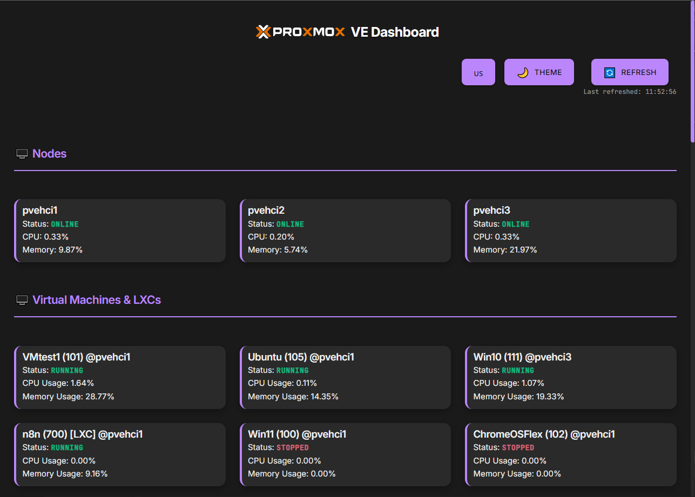

# Proxmox VE Dashboard <sub>v0.1</sub>

An easy, modern and responsive dashboard for Proxmox VE that provides an intuitive interface for monitoring nodes, virtual machines and containers.

[](README.md)
[](README.md)
[](LICENSE)

## 📸 Screenshots



## 🌍 Available Languages / 可用語言 / 可用语言 / 利用可能な言語 / 사용 가능한 언어

- [English](README.md) (Default)
- [繁體中文](README.zh-TW.md)
- [简体中文](README.zh-CN.md)
- [日本語](README.ja.md)
- [한국어](README.ko.md)

## ✨ Features

### 🖥️ Monitoring Features
- **Real-time Node Monitoring**: CPU, memory usage, node status
- **Virtual Machine Management**: VM status, resource usage, real-time updates
- **LXC Container Management**: Container status monitoring and resource statistics
- **Auto-refresh**: Automatic data updates every 15 seconds

### 🎨 User Interface
- **Responsive Design**: Supports desktop, tablet, mobile and other devices
- **Dark/Light Theme**: Switchable modern themes
- **Multi-language Support**: Traditional Chinese, Simplified Chinese, English, Japanese, Korean
- **Intuitive Operation**: Click cards to refresh individual item status

### ⚙️ Settings Management
- **First Run Setup**: Automatically pops up settings dialog
- **Connection Testing**: Test Proxmox connection before setup
- **Settings Persistence**: Settings saved to `settings.json`
- **Dynamic Settings**: Apply new settings without restart

## 🚀 Quick Start

### System Requirements
- Node.js 18+ 
- Network connection to Proxmox VE server
- Proxmox VE API Token

### Installation Steps

1. **Clone Project**
   ```bash
   git clone https://github.com/anomixer/proxmox-dashboard.git
   cd proxmox-dashboard
   ```

2. **Install Dependencies**
   ```bash
   npm install
   ```

3. **Start Service**
   ```bash
   node server.js
   ```

4. **Open Browser**
   Visit `http://localhost:3000`

### First Time Setup

1. **Get Proxmox API Token**
   - Login to Proxmox VE Web interface
   - Go to `Datacenter` → `Permissions` → `API Tokens`
   - Create new Token (recommended format: `root@pam!dashboard-token`)

2. **Set Connection Information**
   - Settings dialog will automatically pop up on first open
   - Enter Proxmox VE host IP address (e.g., 192.168.1.100)
   - Enter Token name (e.g., root@pam!token-name)
   - Enter Token value (your API token secret, e.g., xxxxxxxx-xxxx-xxxx-xxxx-xxxxxxxxxxxx)
   - Click "Test Connection" to confirm connection
   - Click "Save and Start"

## 📖 Usage Guide

### Main Features

#### Node Monitoring
- Display all Proxmox node status
- Real-time CPU and memory usage
- Click node cards to refresh status

#### Virtual Machine Management
- Display all VMs and LXC containers
- Status indicators (running/stopped) - running VMs are displayed first
- Resource usage statistics
- Click cards to refresh individual items

#### Settings Management
- Click "⚙️ Settings" button in top right
- Modify Proxmox connection information
- Support connection testing

### Theme and Language
- **Theme Toggle**: Click "🌙 Theme" button
- **Language Toggle**: Click "🇺🇸 Language" button to cycle through languages

## 🛠️ Technical Architecture

### Backend Technology
- **Node.js**: Server runtime environment
- **Express.js**: Web framework
- **Axios**: HTTP client
- **File System**: Configuration file management

### Frontend Technology
- **Native JavaScript**: No framework dependencies
- **CSS3**: Modern styles and animations
- **HTML5**: Semantic markup
- **Responsive Design**: Responsive layout

### API Endpoints
- `GET /api/status` - Get node and VM status
- `GET /api/settings` - Get current settings
- `POST /api/settings` - Update settings
- `POST /api/test-connection` - Test connection
- `GET /api/check-first-run` - Check if first run

## 📁 Project Structure

```
proxmox-dashboard/
├── server.js              # Main server file
├── package.json           # Project configuration
├── settings.json          # Settings file (auto-generated)
├── README.md             # Project documentation
├── public/               # Static files
│   ├── index.html        # Main page
│   ├── script.js         # Frontend logic
│   ├── style.css         # Style file
│   └── *.svg            # Proxmox Logo
└── node_modules/         # Dependencies
```

## 🔧 Configuration

### Settings File Format (`settings.json`)
```json
{
  "proxmox_host": "192.168.1.100",
  "proxmox_token_name": "root@pam!token-name",
  "proxmox_token_value": "xxxxxxxx-xxxx-xxxx-xxxx-xxxxxxxxxxxx"
}
```

### Environment Variables
Currently supported environment variables:
- `PORT`: Server port number (default: 3000)

## 🐛 Troubleshooting

### Common Issues

**Q: Cannot connect to Proxmox server**
- Confirm Proxmox host IP address is correct
- Check firewall settings (port 8006)
- Confirm API Token has sufficient permissions

**Q: Settings dialog doesn't pop up**
- Clear browser cache
- Confirm `settings.json` file doesn't exist
- Check browser Console error messages

**Q: Data doesn't update**
- Check network connection
- Confirm Proxmox API Token is valid
- Check server Console error messages

### Debug Mode
Open browser developer tools (F12) and check error messages in Console tab.

## 🤝 Contributing

Welcome to submit Issues and Pull Requests!

### Development Environment Setup
1. Fork project
2. Create feature branch: `git checkout -b feature/amazing-feature`
3. Commit changes: `git commit -m 'Add amazing feature'`
4. Push branch: `git push origin feature/amazing-feature`
5. Create Pull Request

### Code Style
- Use 2 space indentation
- Follow ESLint rules
- Add appropriate comments

## 📄 License

This project is licensed under the MIT License - see the [LICENSE](LICENSE) file for details

## 🙏 Acknowledgments

- [Proxmox VE](https://www.proxmox.com/) - Excellent virtualization platform
- [Node.js](https://nodejs.org/) - JavaScript runtime environment
- [Express.js](https://expressjs.com/) - Web application framework

---

⭐ If this project helps you, please give it a Star!

---

**This App is created with the assistance of [Cursor](https://github.com/cursor/cursor) and [Gemini-CLI](https://github.com/google-gemini/gemini-cli)** 