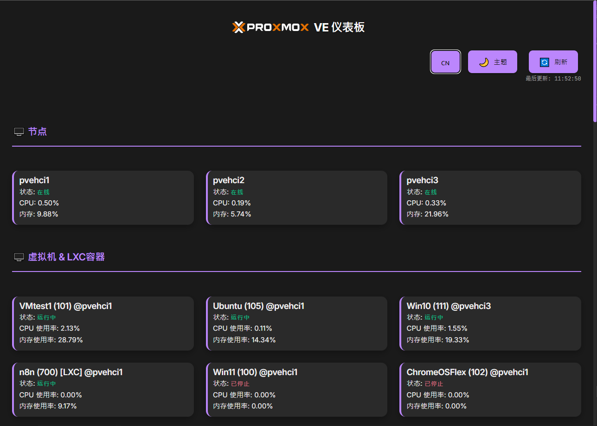

# Proxmox VE 仪表板 <sub>v0.1</sub>

一个简易、现代化且响应式的 Proxmox VE 仪表板，提供直观的节点、虚拟机和容器监控界面。


## 📸 截图



## ✨ 功能特色

### 🖥️ 监控功能
- **实时节点监控**：CPU、内存使用率、节点状态
- **虚拟机管理**：VM 状态、资源使用情况、实时更新
- **LXC 容器管理**：容器状态监控和资源统计
- **自动刷新**：每 15 秒自动更新数据

### 🎨 用户界面
- **响应式设计**：支持桌面、平板、手机等各种设备
- **深色/浅色主题**：可切换的现代化主题
- **多语言支持**：繁体中文、简体中文、英文、日文、韩文
- **直观操作**：点击卡片即可刷新个别项目状态

### ⚙️ 设置管理
- **首次运行设置**：自动弹出设置对话框
- **连接测试**：设置前可测试 Proxmox 连接
- **设置持久化**：设置保存至 `settings.json`
- **动态设置**：无需重启即可应用新设置

## 🚀 快速开始

### 系统要求
- Node.js 18+ 
- 网络连接至 Proxmox VE 服务器
- Proxmox VE API Token

### 安装步骤

1. **克隆项目**
   ```bash
   git clone https://github.com/anomixer/proxmox-dashboard.git
   cd proxmox-dashboard
   ```

2. **安装依赖**
   ```bash
   npm install
   ```

3. **启动服务**
   ```bash
   node server.js
   ```

4. **打开浏览器**
   访问 `http://localhost:3000`

### 首次设置

1. **获取 Proxmox API Token**
   - 登录 Proxmox VE Web 界面
   - 前往 `Datacenter` → `Permissions` → `API Tokens`
   - 创建新的 Token（建议格式：`root@pam!dashboard-token`）

2. **设置连接信息**
   - 首次打开会自动弹出设置对话框
   - 输入 Proxmox VE 主机 IP 地址（例如：192.168.1.100）
   - 输入 Token 名称（例如：root@pam!token-name）
   - 输入 Token 值（您的 API Token 密钥，例如：xxxxxxxx-xxxx-xxxx-xxxx-xxxxxxxxxxxx）
   - 点击「测试连接」确认连接正常
   - 点击「保存并开始使用」

## 📖 使用说明

### 主要功能

#### 节点监控
- 显示所有 Proxmox VE 节点状态
- 实时 CPU 和内存使用率
- 点击节点卡片可刷新状态

#### 虚拟机管理
- 显示所有 VM 和 LXC 容器
- 状态指示器（运行中/已停止）- 运行中的会优先显示
- 资源使用统计
- 点击卡片可刷新个别项目

#### 设置管理
- 点击右上角「⚙️ 设置」按钮
- 可修改 Proxmox 连接信息
- 支持连接测试功能

### 主题和语言
- **主题切换**：点击「🌙 主题」按钮
- **语言切换**：点击「🇨🇳 语言」按钮循环切换

## 🛠️ 技术架构

### 后端技术
- **Node.js**：服务器运行环境
- **Express.js**：Web 框架
- **Axios**：HTTP 客户端
- **File System**：配置文件管理

### 前端技术
- **原生 JavaScript**：无框架依赖
- **CSS3**：现代化样式和动画
- **HTML5**：语义化标记
- **Responsive Design**：响应式布局

### API 端点
- `GET /api/status` - 获取节点和 VM 状态
- `GET /api/settings` - 获取当前设置
- `POST /api/settings` - 更新设置
- `POST /api/test-connection` - 测试连接
- `GET /api/check-first-run` - 检查是否首次运行

## 📁 项目结构

```
proxmox-dashboard/
├── server.js              # 主服务器文件
├── package.json           # 项目配置
├── settings.json          # 配置文件（自动生成）
├── README.md             # 项目说明
├── public/               # 静态文件
│   ├── index.html        # 主页面
│   ├── script.js         # 前端逻辑
│   ├── style.css         # 样式文件
│   └── *.svg            # Proxmox Logo
└── node_modules/         # 依赖包
```

## 🔧 配置说明

### 配置文件格式 (`settings.json`)
```json
{
  "proxmox_host": "192.168.1.100",
  "proxmox_token_name": "root@pam!token-name",
  "proxmox_token_value": "xxxxxxxx-xxxx-xxxx-xxxx-xxxxxxxxxxxx"
}
```

### 环境变量
目前支持的环境变量：
- `PORT`：服务器端口号（默认：3000）

## 🐛 故障排除

### 常见问题

**Q: 无法连接到 Proxmox 服务器**
- 确认 Proxmox 主机 IP 地址正确
- 检查防火墙设置（端口 8006）
- 确认 API Token 权限足够

**Q: 设置对话框没有弹出**
- 清除浏览器缓存
- 确认 `settings.json` 文件不存在
- 检查浏览器 Console 错误信息

**Q: 数据没有更新**
- 检查网络连接
- 确认 Proxmox API Token 有效
- 查看服务器 Console 错误信息

### 调试模式
打开浏览器开发者工具 (F12)，查看 Console 标签的错误信息。

## 🤝 贡献指南

欢迎提交 Issue 和 Pull Request！

### 开发环境设置
1. Fork 项目
2. 创建功能分支：`git checkout -b feature/amazing-feature`
3. 提交变更：`git commit -m 'Add amazing feature'`
4. 推送分支：`git push origin feature/amazing-feature`
5. 创建 Pull Request

### 代码风格
- 使用 2 空格缩进
- 遵循 ESLint 规则
- 添加适当的注释

## 📄 授权条款

本项目采用 MIT 授权条款 - 详见 [LICENSE](LICENSE) 文件

## 🙏 致谢

- [Proxmox VE](https://www.proxmox.com/) - 优秀的虚拟化平台
- [Node.js](https://nodejs.org/) - JavaScript 运行环境
- [Express.js](https://expressjs.com/) - Web 应用框架

---

⭐ 如果这个项目对您有帮助，请给个 Star！

---

**此应用程序由 [Cursor](https://github.com/cursor/cursor) 和 [Gemini-CLI](https://github.com/google-gemini/gemini-cli) 协助创建** 