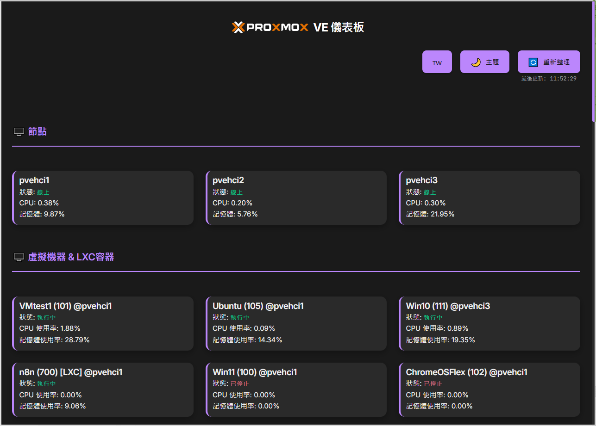

# Proxmox VE 儀表板

一個簡易、現代化且響應式的 Proxmox VE 儀表板 — 監控節點、VM 與容器，一鍵開關機與開啟 noVNC 主控台。

[](README.md)
[](README.md)
[](LICENSE)

## 📸 截圖



## 🌍 可用語言

- [English](README.md) (預設)
- [繁體中文](README.zh-TW.md)
- [简体中文](README.zh-CN.md)
- [日本語](README.ja.md)
- [한국어](README.ko.md)

## ✨ 功能特色

### 🖥️ 監控功能
- **即時節點監控**：CPU、記憶體使用率、節點狀態
- **節點 Shell 主控台**：點擊在線的節點可開啟 Shell 主控台
- **硬碟使用率**：節點卡片顯示硬碟使用率與 CPU、記憶體並列
- **虛擬機器與容器監控**：VM/LXC 狀態、資源使用、即時更新
- **自動刷新**：每 15 秒自動更新資料
- **一鍵開機**：點擊已關機的 VM/LXC 即可啟動
- **noVNC 主控台**：點擊執行中的 VM/LXC 在新分頁開啟主控台

### 🎨 使用者介面
- **響應式設計**：支援桌面、平板、手機等各種裝置
- **深色/淺色主題**：可切換的現代化主題
- **多語言支援**：繁體中文、簡體中文、英文、日文、韓文
- **直觀操作**：點擊執行中的 VM/LXC 卡片開啟 noVNC 主控台；點擊已關機的 VM/LXC 可開機
- **開關機計數**：區段標題顯示節點和 VM 的開機/關機數量

### ⚙️ 設定管理
- **首次執行設定**：自動彈出設定對話框
- **連線測試**：設定前可測試 Proxmox 連線
- **設定持久化**：設定儲存至 `settings.json`
- **動態設定**：無需重啟即可套用新設定

## 🚀 快速開始

### 系統需求
- Node.js 18+ 
- 可連線至 Proxmox VE 伺服器的網路
- Proxmox VE API Token

### 安裝步驟

1. **克隆專案**
   ```bash
   git clone https://github.com/anomixer/proxmox-dashboard.git
   cd proxmox-dashboard
   ```

2. **安裝依賴**
   ```bash
   npm install
   ```

3. **啟動服務**
   ```bash
   node server.js
   ```

4. **開啟瀏覽器**
   訪問 `http://localhost:3000`

### 首次設定

1. **取得 Proxmox API Token**
   - 登入 Proxmox VE Web 介面
   - 前往 `Datacenter` → `Permissions` → `API Tokens`
   - 建立新的 Token（Token ID: token-name，取消勾選「權限分離（Privilege Separation）」，點擊「新增（Add）」）
   - 妥善保存 Token Secret（Token ID: root@pam!token-name，點擊「複製密鑰（Copy Secret Value）」）

2. **設定連線資訊**
   - 首次開啟會自動彈出設定對話框
   - 輸入 Proxmox VE 主機 IP 位址（例如：192.168.1.100）
   - 輸入 Token 名稱（例如：root@pam!token-name）
   - 輸入 Token 值（您的 API Token 密鑰，例如：xxxxxxxx-xxxx-xxxx-xxxx-xxxxxxxxxxxx）
   - 點擊「測試連線」確認連線正常
   - 點擊「儲存並開始使用」

## 📖 使用說明

### 主要功能

#### 節點監控
- 顯示所有 Proxmox VE 節點狀態
- 即時 CPU 和記憶體使用率
- 點擊節點卡片可刷新狀態

#### 虛擬機器與容器監控
- 顯示所有 VM 和 LXC 容器
- 狀態指示（執行中/已停止）- 執行中的會優先顯示
- 資源使用統計
- 點擊已關機的 VM/LXC 可開機（需確認）
- 點擊執行中的 VM/LXC 可開啟 noVNC 主控台

#### 設定管理
- 點擊右上角「⚙️ 設定」按鈕
- 修改 Proxmox VE 連線資訊
- 支援連線測試

### 主題和語言
- **主題切換**：點擊「🌙 主題」按鈕
- **語言切換**：點擊「🇹🇼 語言」按鈕循環切換

## 🛠️ 技術架構

### 後端技術
- **Node.js**：伺服器運行環境
- **Express.js**：Web 框架
- **Axios**：HTTP 客戶端
- **File System**：設定檔管理

### 前端技術
- **原生 JavaScript**：無框架依賴
- **CSS3**：現代樣式與動畫
- **HTML5**：語義化標記
- **響應式設計**：自適應佈局

### API 端點
- `GET /api/status` - 取得節點和 VM 狀態
- `GET /api/settings` - 取得當前設定
- `POST /api/settings` - 更新設定
- `POST /api/test-connection` - 測試連線
- `GET /api/check-first-run` - 檢查是否首次執行
- `POST /api/vm/start` - 啟動 VM
- `POST /api/lxc/start` - 啟動 LXC 容器

## 📁 專案結構

```
proxmox-dashboard/
├── server.js              # 主伺服器檔案
├── package.json           # 專案配置
├── settings.json          # 設定檔（自動生成）
├── README.md              # 專案說明
├── public/               # 靜態檔案
│   ├── index.html        # 主頁面
│   ├── script.js         # 前端邏輯
│   ├── style.css         # 樣式檔案
│   └── *.svg            # Proxmox Logo
└── node_modules/         # 依賴套件
```

## 🔧 配置說明

### 設定檔格式（`settings.json`）
```json
{
  "proxmox_host": "192.168.1.100",
  "proxmox_token_name": "root@pam!token-name",
  "proxmox_token_value": "xxxxxxxx-xxxx-xxxx-xxxx-xxxxxxxxxxxx"
}
```

### 環境變數
目前支援的環境變數：
- `PORT`：伺服器埠號（預設：3000）

## ☁️ 部署至 Cloudflare Tunnel（遠端存取）

如需從外部網路存取儀表板，而無需開放 Proxmox 主機埠號，請使用 Cloudflare Tunnel：

1. **在 Proxmox 主機上安裝 cloudflared 並啟動**：
   ```bash
   # 先啟動儀表板
   node server.js &
   
   # 執行 Cloudflare Tunnel（需先安裝 cloudflared）
   cloudflared tunnel --url http://localhost:3000
   ```

2. **永久設定**（建議）：
   ```bash
   cloudflared tunnel create proxmox-dash
   cloudflared tunnel route dns proxmox-dash dash.yourdomain.com
   cloudflared tunnel run --url http://localhost:3000 proxmox-dash
   ```

3. 開啟 `https://dash.yourdomain.com` — HTTPS 自動生效，無需設定轉埠。

> ⚠️ **Demo Only! — GitHub Pages / 靜態託管**：GitHub Pages 版本（`https://anomixer.github.io/proxmox-dashboard/`）為**純靜態頁面** — API 請求會失敗，因為無後端伺服器。你必須在本機執行 `node server.js`（可搭配 Cloudflare Tunnel）才能使用完整功能。

## 🐛 故障排除

### 常見問題

**Q: 無法連接到 Proxmox 伺服器**
- **GitHub Pages 版本僅為示範用** — `https://anomixer.github.io/proxmox-dashboard/` 無後端 API，請在本機執行 `node server.js`（或搭配 Cloudflare Tunnel）才能正常使用。
- 確認 Proxmox 主機 IP 位址正確
- 檢查防火牆設定（埠號 8006）
- 確認 API Token 權限足夠

**Q: 設定對話框沒有彈出**
- 清除瀏覽器快取
- 確認 `settings.json` 檔案不存在
- 檢查瀏覽器 Console 錯誤訊息

**Q: 資料沒有更新**
- 檢查網路連線
- 確認 Proxmox API Token 有效
- 查看伺服器 Console 錯誤訊息

### 除錯模式
開啟瀏覽器開發者工具（F12），查看 Console 標籤的錯誤訊息。

## 🤝 貢獻指南

歡迎提交 Issue 和 Pull Request！

### 開發環境設定
1. Fork 專案
2. 建立功能分支：`git checkout -b feature/amazing-feature`
3. 提交變更：`git commit -m 'Add amazing feature'`
4. 推送分支：`git push origin feature/amazing-feature`
5. 建立 Pull Request

### 程式碼風格
- 使用 2 空格縮排
- 遵循 ESLint 規則
- 添加適當註解

## 📄 授權條款

本專案採用 MIT 授權條款 - 詳見 [LICENSE](LICENSE) 檔案

## 🙏 致謝

- [Proxmox VE](https://www.proxmox.com/) - 優秀的虛擬化平台
- [Node.js](https://nodejs.org/) - JavaScript 運行環境
- [Express.js](https://expressjs.com/) - Web 應用框架

---

⭐ 如果這個專案對您有幫助，請給個 Star！

---

**此應用程式由 [Cursor](https://github.com/cursor/cursor) 和 [Gemini-CLI](https://github.com/google-gemini/gemini-cli) 協助創建**